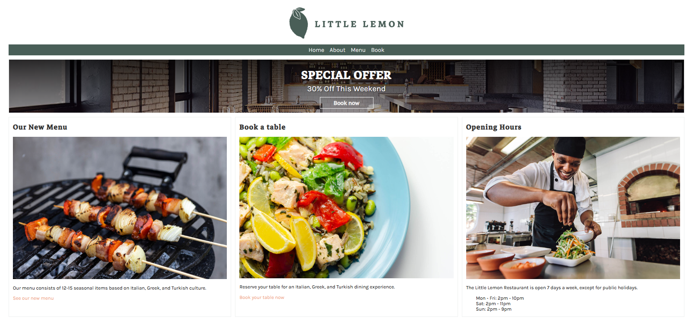
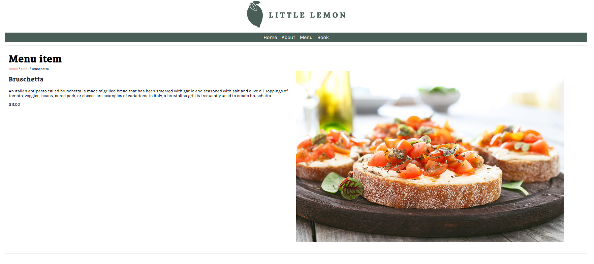
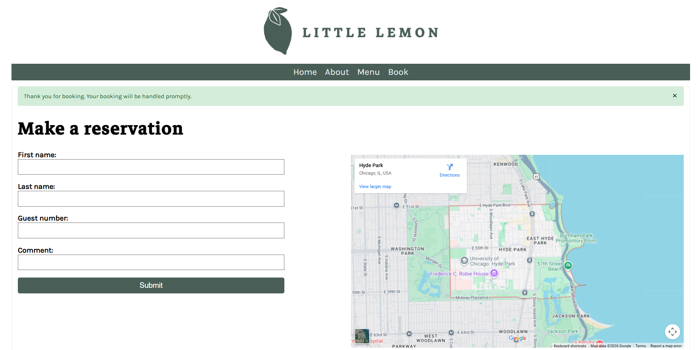

# Meta-Django-Web-FrameWork-Little-Lemon

Django project for a fictional restaurant named LittleLemon. The project comes with menu listing, detail view and booking.

## Restaurant Management System

A lightweight **Django 5.x** web application for managing restaurant reservations and displaying a dynamic menu with item details.

### 🚀 Features

* **Dynamic Menu:** Browse menu items with real-time pricing and images.
* **Detail View:** Dedicated pages for each menu item with descriptions.
* **Reservations:** Functional booking form with automated "Thank You" notifications.
* **Responsive Design:** Semantic HTML5 (`<article>`, `<section>`) and clean CSS.

### 🛠️ Tech Stack

* **Framework:** Django
* **Frontend:** HTML5, CSS3, Django Template
* **Database:** SQLite (Default)

To get your Django project running quickly, here are the essential steps.

### 1. Installation

Run these commands in your terminal to set up the environment and install the necessary framework:

**Bash**

```
# Create the virtual environment
python -m venv .venv

# Activate the environment
# Windows:
.venv\Scripts\activate
# macOS/Linux:
source .venv/bin/activate

# Install Django
pip install django
```

---

### 2. How to Run the Project

Once installed, you need to prepare the database and start the development server:

1. **Apply Migrations:** This sets up the database tables (for your menu and bookings).
   **Bash**

   ```
   python manage.py migrate
   ```
2. **Start the Server:**
   **Bash**

   ```
   python manage.py runserver
   ```
3. **View the Site:** Open your browser and go to `http://127.0.0.1:8000/`.

---

### Home View



### Menu List




### Booking


